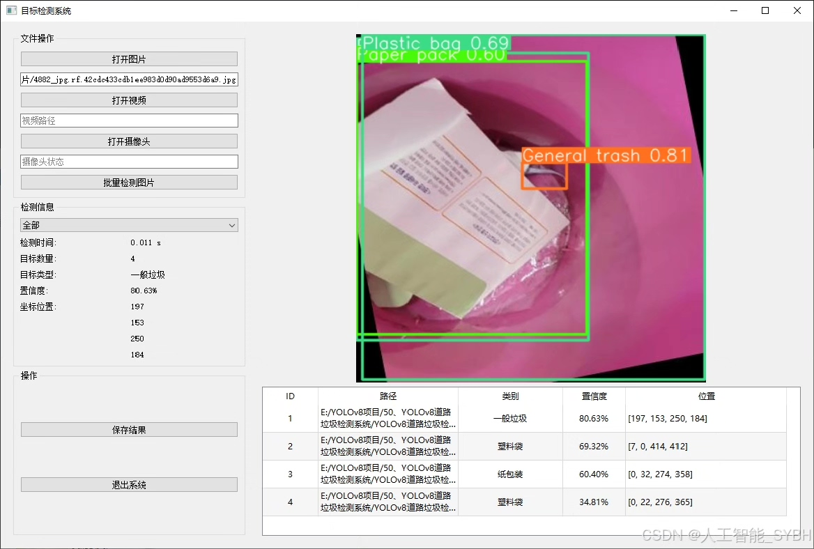
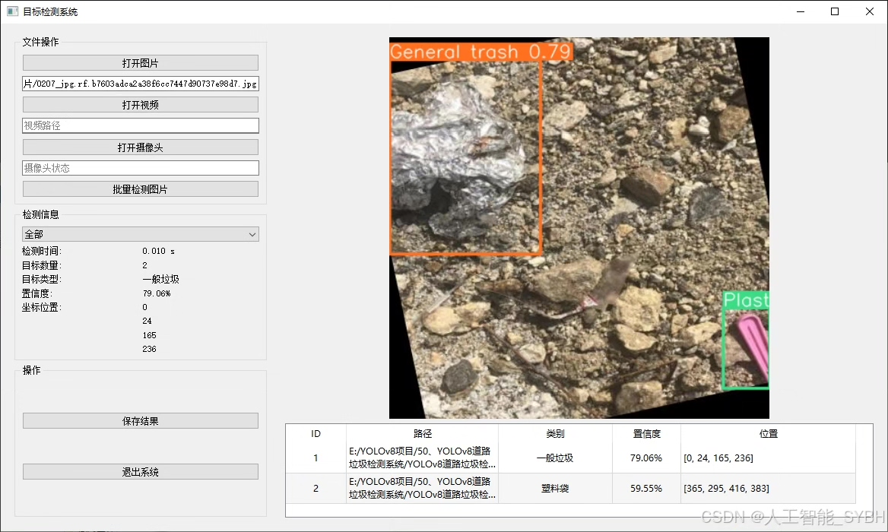
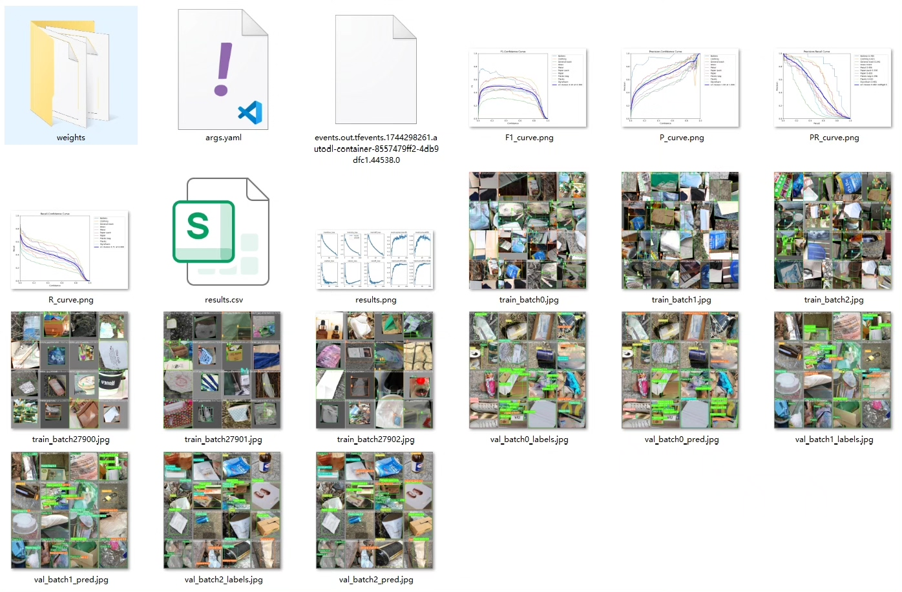
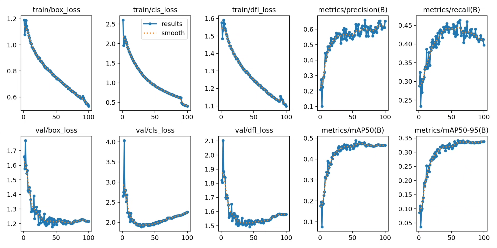
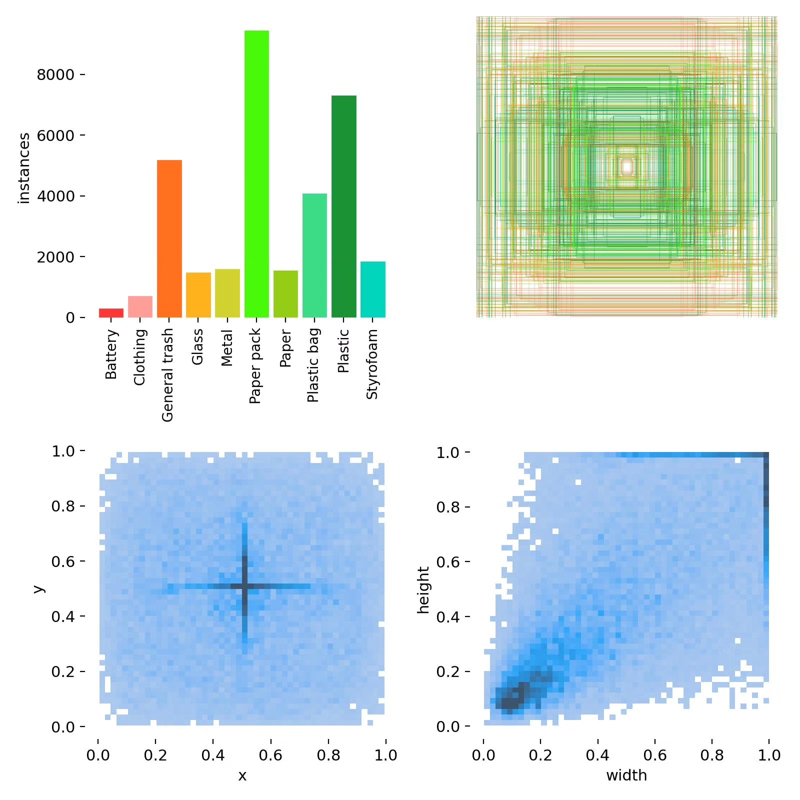
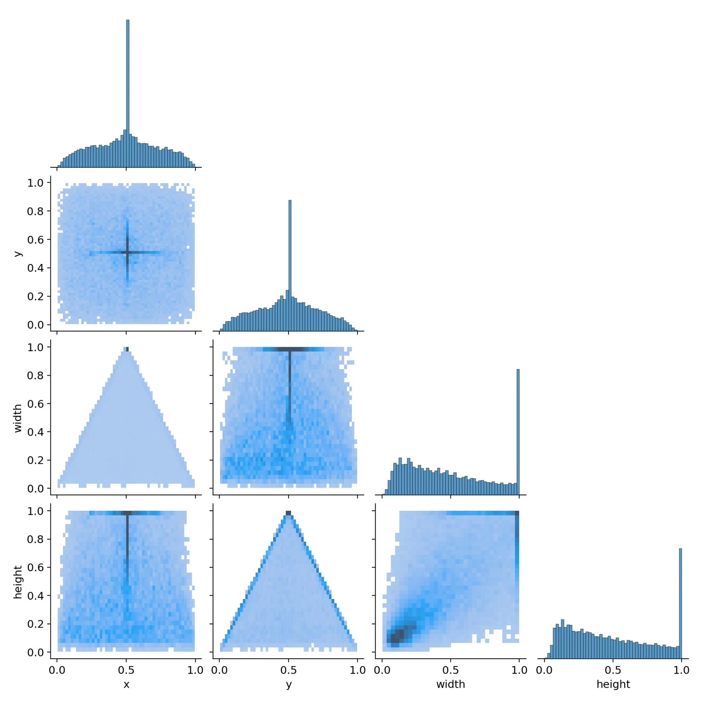
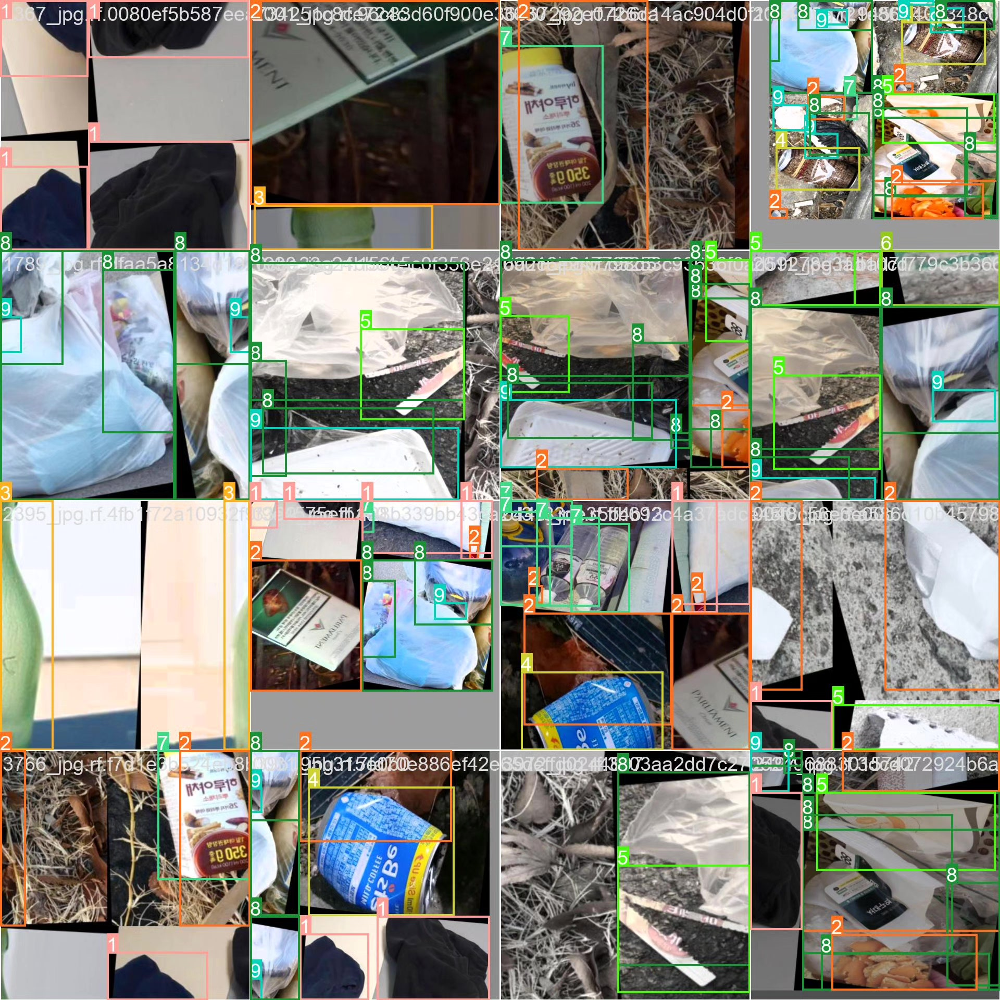
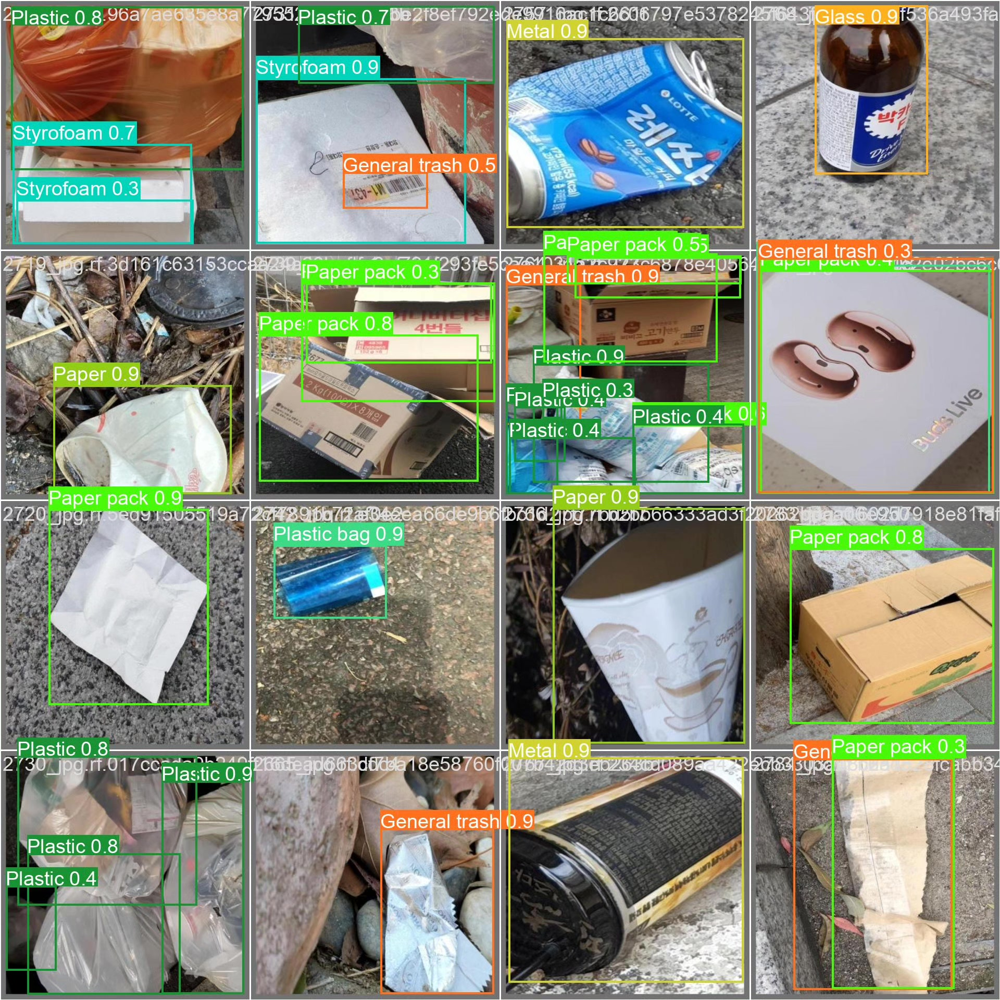

# Based on YOLOv8 Deep Learning Road Waste Detection System (YOLOv8+Y)

## Body

Based on the YOLOv8 deep learning algorithm, this project has developed a road waste detection system for urban roads. It specifically targets the recognition and localization of 10 common types of waste items in urban road environments. The training dataset contains a total of 11,372 labeled images, including 9,909 training images, 977 validation images, and 486 test images. The detection target categories include: Battery (Battery), Clothing (Clothing), General trash (General trash), Glass (Glass), Metal (Metal), Paper pack (Paper pack), Paper (Paper), Plastic bag (Plastic bag), Plastic product (Plastic), and Styrofoam (Styrofoam). By optimizing the structure of the YOLOv8 model and training strategies, the system achieves high-precision real-time detection of road waste, providing effective technical support for urban environmental management and intelligent sanitation systems.

The company's products have obtained the official commercial license certification from YOLO.

We provide after-sales service.

After payment, we will provide WeChat ID to answer questions at any time.

Environment configuration: We will provide an environment configuration tutorial, and WeChat will provide答疑.

Remote installation service: If you need remote configuration, an additional fee of 69 is required,
If the configuration fails, all fees are refundable (only refund installation fees for special old computers)

Retraining dataset: After configuring the environment, you can train on your own computer.
If you need us to retrain, just pay 69 + computing power fees (2.5 yuan/hour)

## Images

## Payment

Here is a pay link on Stripe ( https://buy.stripe.com/3cs8yP7sY87d0vu9AB ). Please contact me lonlonago@foxmail.com after funding $89, and I will send you a complete data files , thank you!

